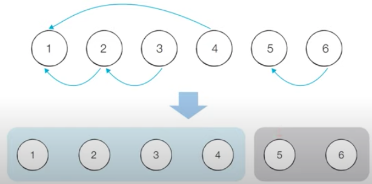
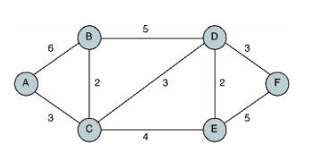

# 그래프 이론

## 다양한 그래프 알고리즘

### 훑어 보기

* DFS/BFS, 최단 경로 알고리즘은 모두 그래프 알고리즘의 한 유형이다.
* 이외에도 다양한 그래프 알고리즘이 존재한다. 출제비중은 낮지만 제대로 알아야 한다.
    * 크루스칼 알고리즘 : 그리디 알고리즘으로 분류
    * 위상 정렬 알고리즘 : 큐/스택 자료구조로 구현 
    

* 그래프
    * 노드와 노드 사이에 연결된 간선의 정보를 가지는 자료구조이다.
    * `서로 다른 개체(객체)가 연결되어 있다` 라는 이야기를 들으면 -> 바로 그래프 알고리즘을 떠올려야한다.
    * 가장 자주 사용되는 자료구조 : Tree 자료구조
    
  | |그래프|트리|
  |---|---|---|
  |방향성|방향 그래프 or 무방향 그래프|방향 그래프(컴퓨터 공학 분야 한정)|
  |순환성|순환 및 비순환|비순환|
  |루트 노드 존재 여부|루트노드 없음|루트노드 있음|
  |노드간 관계성|부모와 자식 관계 없음|부모와 자식관계 있음|
  |모델의 종류|네트워크 모델|계층 모델|


* 그래프의 구현 방법
    1. `인접 행렬` : 2차원 배열을 사용하는 방식
    2. `인접 리스트` : 리스트를 사용하는 방식
    
  |노드의 개수 = V, 간선의 개수 = E|인접 행렬|인접 리스트|
  |---|---|---|
  |메모리 공간|O(V^2)|O(E)|
  |특정 노드에서 다른 노드로 이어진 간선의 비용(시간)|O(1)|O(V)|
  |알고리즘|플로이드 워셜|다익스트라 최단 경로 (우선순위 큐)|
  |문제|최단경로 문제 + 노드의 개수가 적은 경우|노드, 간선의 개수가 많은 경우|

### 서로소 집합

- `서로소 집합` : 공통원소가 없는 두 집합

#### 서로소 집합 자료구조

- 서로소 부분 집합들로 나누어진 원소들의 데이터를 처리하기 위한 자료구조
  - union, find 2개의 연산으로 서로소 집합 자료구조를 조작할 수 있다.
  

- `union(합집합) 연산` : 2개의 원소가 포함된 집합을 하나의 집합으로 합치는 연산
- `find(찾기) 연산` : 특정한 원소가 속한 집합이 어떤 집합인지 알려주는 연산
  - 서로소 집합 자료구조를 union-find 자료구조라고 한다.
  

- 서로소 집합 자료구조는 트리 자료구조를 이용하여 집합을 표현한다.
> 1. union 연산을 확인하여, 서로 연결된 두 노드 A,B를 확인한다.
>   - A와 B의 루트 노드 A',B'를 각각 찾는다.
>   - A'를 B'의 부모 노드로 설정한다.(B'가 A'를 가리키도록 한다.)
>     - 보통 번호가 작은 원소가 부모 노드가 되도록 구현하는 경우가 많다.
>     - 즉, A'=1, B'=3이면 B'가 A'를 가리키도록 설정한다.
> 2. 모든 union 연산을 처리할 때까지 1번 과정을 반복한다.


##### 예시

> union 1,4 union 2,3 union 2,4 union 5,6

- 4개의 union 연산이 있다.
  - 각각, 1과 4는 같은집합. 2와 3은 같은 집합. 2와 4는 같은 집합. 5와 6은 같은 집합의 의미를 가진다.
  - 4개의 union연산이 수행된 후, 전체 원소들의 부분 집합 형태를 확인해보자.
  
1. 
- 먼저 노드의 개수(V) 크기의 **부모 테이블**을 초기화한다. 이때 모든 원소가 자기 자신을 부모로 가지도록한다.

|노드번호|1|2|3|4|5|6|
|---|---|---|---|---|---|---|
|부모|1|2|3|4|5|6|

2.
- `union 1,4`을 수행한다.
  - 1과 4를 합친다.
  - 노드 4의 부모노드를 노드 1로 설정한다.
 
|노드번호|1|2|3|4|5|6|
|---|---|---|---|---|---|---|
|부모|1|2|3|1|5|6| 

3.
- `union 2,3`을 수행한다.
  - 2과 3를 합친다.
  - 노드 3의 부모노드를 노드 2로 설정한다.
 
|노드번호|1|2|3|4|5|6|
|---|---|---|---|---|---|---|
|부모|1|2|2|1|5|6| 

4.
- `union 2,4`을 수행한다.
  - 2과 4를 합친다.
  - **노드 2와 노드 4의 루트 노드를 각각 찾는다.**
    - 노드 2의 루트 노드 == 2
    - 노드 4의 루트 노드 == 1
      - 루트 노드 2의 부모를 1로 설정한다. (재귀적인 부분)
 
|노드번호|1|2|3|4|5|6|
|---|---|---|---|---|---|---|
|부모|1|1|2|1|5|6| 

5.
- `union 5,6`을 수행한다.
  - 5과 6를 합친다.
  - 노드 6의 부모노드를 노드 5로 설정한다.
 
|노드번호|1|2|3|4|5|6|
|---|---|---|---|---|---|---|
|부모|1|1|2|1|5|5| 



##### 코드

```python
# 특정 원소가 속한 집합을 찾기
def find_parent(parent, x):
    #루트 노드를 찾을때까지 따라들어가며 재귀호출 (루트노드는 자기자신이 부모노드이므로)
    if parent[x] != x: #x가 루트노드가 아니라면
        parent[x] =  find_parent(parent, parent[x])
    return parent[x]

#두 원소가 속한 집합을 합치기 
def union_parent(parent, a, b):
    a = find_parent(parent, a)
    b = find_parent(parent, b)
    if a<b: #두 노드중 큰 노드의 부모를 바꿔준다.
        parent[b] = a
    else:
        parent[a] = b
      
v,e = map(int,input().split())
parent = [0] * (v+1)

for i in range(1,v+1):
    parent[i] = i
    
for i in range(e):
    a,b = map(int,input().split())
    union_parent(parent,a,b)
    
for i in range(1,v+1):
    print(find_parent(parent,i), end=" ")
    
print()

print("부모 테이블 : ", end=" ")
for i in range(1,v+1):
    print(parent[i], end=" ")
    
```

#### 서로소 집합을 활용한 사이클 판별
- 서로소 집합은 다영한 알고리즘에 사용가능하다.
  - 무방향 그래프 내에서의 사이클을 판별할 때 사용할 수 있다.
  
- 두 노드가 포함되어 있는 집합을 합치는 과정을 반복하는 것만으로도 사이클을 판별할 수 있다.
> 1. 각 간선을 확인하며 두 노드의 루트 노드를 확인한다.
>   - 루트 노드가 서로 다르다면 두 노드에 대하여 union 연산을 수행한다.
>   - 루트 노드가 서로 같다면 사이클이 발생한 것이다.
> 2. 그래프에 포함되어 있는 모든 간서에 대해 1번과정을 반복한다.

##### 코드
```python
# 특정 원소가 속한 집합을 찾기
def find_parent(parent, x):
    #루트 노드를 찾을때까지 따라들어가며 재귀호출 (루트노드는 자기자신이 부모노드이므로)
    if parent[x] != x: #x가 루트노드가 아니라면
        parent[x] =  find_parent(parent, parent[x])
    return parent[x]

#두 원소가 속한 집합을 합치기 
def union_parent(parent, a, b):
    a = find_parent(parent, a)
    b = find_parent(parent, b)
    if a<b: #두 노드중 큰 노드의 부모를 바꿔준다.
        parent[b] = a
    else:
        parent[a] = b

v,e = map(int, input().split())
parent = [0] * (v+1) #부모테이블

#초기상태 - 부모를 자기자신으로 초기화
for i in range(1,v+1):
    parent[i] = i
 
cycle = False #사이블 발생여부

for i in range(e):
    a,b = map(int, input().split())
    #사이클이 발생한 경우 종료
    if find_parent(parent,a) == find_parent(parent, b):
        cycle = True
        break
    else:
        union_parent(parent, a, b)

if cycle:
    print('사이클이 발생했습니다.')
else:
    print('사이클이 발생하지 않았습니다.')
```

### 신장 트리

- `신장 트리` : 하나의 그래프가 있을 때 모든 노드를 포함하면서 사이클이 존재하지 않는 부분 그래프이다.

  
  - A,B,C,D,E,F 노드를 포함하면서 사이클이 존재하지 않는다.
  

- `최소 신장 트리 알고리즘` : 노드를 모두 연결할 때 최소한의 비용으로 만들 수 있는 트리를 찾는 알고리즘이다.
  - 대표적인 최소 신장 트리 알고리즘 : **크루스칼 알고리즘**이다.
  
#### 크루스칼 알고리즘
- 그리디 알고리즘으로 분류된다.
  - 모든 간선에 대해 정렬을 수행한 뒤, 가장 거리가 짧은 간선부터 집합에 포함시킨다.
  - 포함시킨 간선이 사이클을 발생시킨다면 집합에 포함시키지 않는다.
  
> 1. 간선 데이터를 비용에 따라 오름차순으로 정렬한다
> 2. 간선을 하나씩 확인하며 현재의 간선이 사이클을 발생시키는지 확인한다.
>   - 사이클이 발생하지 않는 경우 최소 신장 트리에 포함시킨다.
>   - 사이클이 발생하는 경우 최소 신장 트리에 포함시키지 않는다.
> 3. 모든 간선에 대하여 2번의 과정을 반복한다.

##### 코드
```python
def find_parent(parent, x):
    if parent[x] != x:
        parent[x] = find_parent(parent, parent[x])
    return parent[x]

def union_parent(parent, a, b):
    a = find_parent(parent,a)
    b = find_parent(parent,b)
    if a<b:
        parent[b] = a
    else:
        parent[a] = b

v,e = map(int, input().split())
parent = [0] * (v+1)

#간선을 담을 리스트, 최종비용을 담을 변수
edges = []
result = 0

for i in range(1, v+1):
    parent[i] = i

for _ in range(e):
    a,b,cost = map(int, input().split())
    edges.append((cost,a,b))

edges.sort()

for edge in edges:
    cost, a, b = edge
    # a,b노드의 루트가 다른경우 = 서로다른 집합인경우 = 사이클이 없다
    if find_parent(parent,a) != find_parent(parent,b):
        union_parent(parent,a,b)
        result += cost

print(result)
```

#### 위상 정렬

- `위상 정렬` : 방향 그래프의 모든 노드를 '방향성에 거스르지 않도록 순서대로 나열하는 것' 이다.

> 1. 진입차수가 0인 노드를 큐에 넣는다
> 2. 큐가 빌 때까지 다음의 과정을 반복한다.
>   - 큐에서 원소를 꺼내 해당 노드에서 출발하는 간선을 그래프에서 제거한다.
>   - 새롭게 진입차수가 0이 된 노드를 큐에 넣는다.

##### 코드
```python
from collections import deque

#노드의 개수와 간선의 개수 입력
v,e = map(int, input().split())
# 모든 노드에 대한 진입차수를 0으로 초기화 ('나'로 들어오는 간선의 개수)
indegree = [0] * (v+1)

#각 노드에 연결된 간선정보를 담기위한 연결리스트 초기화
graph = [[] for _ in range(v+1)]

# 방향 그래프의 모든 간선정보 입력받기
for _ in range(e):
    a,b = map(int, input().split())
    graph[a].append(b) # 정점 a에서 b로 이동 
    indegree[b] +=1 #진입차수 증가

# 위상정렬 함수
def topology_sort():
    result = [] # 알고리즘 수행결과를 담을 리스트
    q = deque() #큐 기능을 위한 라이브러리 사용
    # 처음 시작할때는 진입차수가 0인 모든 노드를 큐에 삽입
    for i in range(1, v+1):
        if indegree[i] == 0:
            q.append(i)
    # 큐가 빌때까지
    while q:
        # 큐에서 꺼내고
        now = q.popleft()
        result.append(now)
        
        # 꺼낸 노드로부터 연결된 노드들을 순회하며 해당 노드들의 진입차수에서 1을 빼고 0이된 노드들이 잇다면 큐에 담는다.
        for i in graph[now]:
            indegree[i] -= 1
            if indegree[i] == 0:
                q.append(i)
    
    #위상정렬의 수행결과 출력
    for i in result:
        print(i)

topology_sort()
```